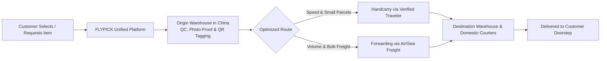

<div align="center">


# ✈️ FLYPICK

### *"From Global Stores to Your Door." · "Your picks, our trips."*

**Unified Cross-Border Commerce, Traveler Handcarry & Fulfillment Platform**

[](https://flypick.id)
[](https://linkedin.com/company/flypick)
[](https://instagram.com/flypick.id)

---

**FLYPICK** is an enterprise cross-border shopping and logistics platform that enables international consumers and merchants to buy products directly from overseas stores and factories — starting on the **China ➔ Indonesia** corridor. We uniquely combine **traveler-based Handcarry** with **consolidated Freight Forwarding**, powered by an auditable, high-security **Warehouse Operating System (WOS)** that guarantees zero lost or damaged items across borders.

</div>

---

## 🧩 The Problem We Solve

Cross-border trade from China to Southeast Asia is **broken, expensive, and stressful**:

| 😟 Informal Jastip | 📦 Rigid Freight | 🛃 Customs Friction |
|:---|:---|:---|
| Fraud in chat apps, zero insurance | Built for bulk B2B cargo only | Shifting duty tiers & surprise bills |
| Opaque pricing & no dispute resolution | No individual item QC or photos | Opaque landing cost formulas |

> **The opportunity:** Consumers and SMBs want unique, factory-priced overseas goods, but **no single platform unites purchasing + warehouse QC inspection + regulatory customs clearance + local doorstep delivery** into one transparent, accountable system.

---

## 💡 The FLYPICK Solution



### Core Value Drivers

| | |
|:---|:---|
| 🔐 **One Account, One Unified Experience** | Shop, request, pay, and track in a single interface |
| 📸 **Real-Time Visual Proof** | High-resolution QC photos the moment your parcel arrives at our origin dock |
| 💰 **Guaranteed Landed Cost** | Total transparency upfront — no hidden customs surcharges or surprise handling fees |
| 🛡️ **Verifiable Chain of Custody** | Every handover recorded and audited across all logistics legs |

---

## 🏢 Four Business Lines, One Platform

All four commercial channels run on our unified **Warehouse Operating System (WOS)**:

### 🧳 1. Handcarry *(Traveler Capacity)*

> *"Not informal personal shopping. This is a verified baggage capacity marketplace."*

- **Model:** Verified travelers monetize excess luggage capacity on scheduled commercial flights
- **Corridor:** China (Guangzhou / Shanghai / Shenzhen / Beijing) ➔ Indonesia (Jakarta / Surabaya / Bali)
- **Goods:** High-urgency items, premium electronics, fashion, personal effects
- **For Travelers:** Legally monetize unused baggage with zero safety risk — all items are screened and verified by FLYPick warehouse staff
- **For Customers:** Faster than standard air freight, complete insurance protection, transparent per-kg pricing

### 📦 2. Forwarding *(Consolidated Freight)*

> *"Shop any Chinese marketplace. Ship to our China hub. We handle the rest."*

- **Model:** Customers ship purchases (Taobao, 1688, Pinduoduo, JD) to FLYPick's China consolidation warehouse
- **Operations:** Dock receiving → QC inspection → consolidation into master cartons → commercial air/sea freight → Jakarta de-consolidation → repacking/rebranding → domestic courier delivery
- **Customs:** Commercial consigned goods (PMK 96/2023 & PMK 4/2025)

### 🛍️ 3. Marketplace *(Direct Catalog)* — Phase 3

- **Model:** Direct catalog shopping within FLYPick. Purchase catalog SKUs with automatic procurement PO on stockout
- **Operations:** Supplier ordering → inbound receiving → automated picking, packing → international transit → final mile delivery

### 🏭 4. 3PL / Warehouse-as-a-Service — Phase 4

- **Model:** Multi-tenant warehouse storage, cross-border fulfillment, repacking, and shipping for external e-commerce brands
- **Operations:** Merchant inventory segregation, client-specific SLAs, external merchant APIs, multi-tenant billing

---

## 🔒 Security & Trust: 4-Checkpoint Chain of Custody

FLYPICK eliminates transit shrinkage through **4 mandatory physical checkpoints**. Every checkpoint records: Operator ID, Timestamp, Warehouse Location, Gross Weight, 1–3 Photographs, and Tamper-Seal Serial Number.

| Checkpoint | Location | Key Actions | Purpose |
|:---:|:---|:---|:---|
| **1** | 🇨🇳 **China Dock Inbound** | Scan vendor tracking, precise gram scale, 3-angle HD photo capture | Verify and record incoming parcels from suppliers |
| **2** | 🇨🇳 **Pre-Export Sealing** | Master carton weighed, tamper-evident seal applied, handover to forwarder/traveler | Seal & secure outbound cargo with tamper-proof evidence |
| **3** | 🇮🇩 **Jakarta Dock Inbound** | Seal serial number verified, unseal, scan all child packages, re-weigh & QC inspect | Validate integrity and condition upon destination arrival |
| **4** | 🇮🇩 **Final-Mile Handover** | Affix domestic courier label, handover to JNE/J&T, verified doorstep delivery | Ensure last-mile delivery accountability to customer |

> **Result:** If an item is damaged or missing, our audit logs pinpoint **exactly which checkpoint, which timestamp, and which operator was responsible.**

---

## 🛒 Customer Experience

For buyers, deep operational complexity becomes a simple 4-step journey:

```
┌──────────────────┐    ┌──────────────────┐    ┌──────────────────┐    ┌──────────────────┐
│ 1. SELECT / PASTE│───▶│ 2. PAY & TRACK   │───▶│ 3. VIEW QC PHOTO │───▶│ 4. DOORSTEP DROP │
│ Choose catalog   │    │ Pay via Bank/VA/ │    │ WhatsApp Alert:  │    │ Domestic courier │
│ SKU or paste an  │    │ QRIS and receive │    │ "Your parcel has │    │ delivers package │
│ external link    │    │ live tracking ID │    │ arrived in China"│    │ to your door     │
└──────────────────┘    └──────────────────┘    └──────────────────┘    └──────────────────┘
```

---

## 💵 Revenue Streams

FLYPICK monetizes across the entire logistics chain:

| # | Revenue Stream | Mechanism |
|:---:|:---|:---|
| 1 | **Warehouse Dock & QC Fee** | Per-parcel receiving, weighing, and photo capture |
| 2 | **Consolidation & Repack Fee** | Master carton consolidation and custom protective repack |
| 3 | **International Freight Spread** | Margin between bulk carrier rates and customer pricing |
| 4 | **Handcarry Platform Spread** | Spread between customer price and traveler payout |
| 5 | **Domestic Courier Margin** | Contractual volume discount on JNE, J&T, SiCepat |
| 6 | **Warehouse Demurrage Fee** | Daily holding fee for packages stored past 14 days |

---

## 🗺️ Corridor & Expansion

```
PRIMARY CORRIDOR (Phase 1)              FUTURE EXPANSION
┌────────────────────────┐         ┌────────────────────────┐
│   CHINA (GUANGZHOU)    │         │  Japan, Korea, USA,    │
│           │            │ ──────▶ │  Singapore, Malaysia   │
│           ▼            │         │           │            │
│  INDONESIA (JAKARTA)   │         │   INDONESIA & ASEAN    │
└────────────────────────┘         └────────────────────────┘
```

**Why China ➔ Indonesia?**
- **China** = manufacturing capital of the world (80%+ of global consumer e-commerce goods)
- **Indonesia** = largest digital economy in Southeast Asia (280M+ population)

---

## 🏗️ Technology Stack

| Layer | Technology | Why |
|:---|:---|:---|
| **Backend** | Go 1.23+ | Extreme concurrency, low memory footprint, compile-time type safety, single binary |
| **Web Frontend** | Next.js 15 (App Router) | Server Components, complex data grids, desktop back-office |
| **Mobile** | React Native / Expo | Native camera access, rugged device support, offline resilience |
| **Database** | PostgreSQL 16+ | ACID truth, schema-per-service isolation, outbox polling engine |
| **Object Storage** | S3-Compatible | Photos, invoices, labels |
| **Cache** | Redis 7+ | Token revocation, caching |
| **Observability** | OpenTelemetry + Grafana + Loki + Sentry | Full tracing, metrics, log aggregation, error tracking |
| **Infrastructure** | Docker / Cloud Run / Fargate | Zero Kubernetes overhead for MVP |

### Architecture Pattern

> **Logical Microservices Architecture** deployed as a **Service-Shaped Modular Monolith** for MVP, with strict Schema-Per-Service PostgreSQL isolation and explicit event contracts.

- Single Go API binary + single background Worker binary
- PostgreSQL Transactional Outbox + Consumer Inbox (zero lost events)
- 11 cohesive bounded contexts with private database schemas
- No cross-schema SQL joins — strict domain encapsulation
- Pluggable network transport when services are physically extracted

---

## 📋 Strategic Roadmap

| Phase | Focus | Timeline |
|:---:|:---|:---|
| **Phase 1** | Core WOS + 4 Checkpoints, Forwarding + Handcarry Foundation, Mobile Scan Engine, Next.js Admin | MVP |
| **Phase 2** | Mature Handcarry Dynamic Pricing, Repacking Hub, Reverse Returns, Multi-Courier API | Q1 2027 |
| **Phase 3** | Open Marketplace Catalog, Automated Sourcing PO, Broad Consumer App Launch | Q2 2027 |
| **Phase 4** | Enterprise 3PL / WaaS Multi-Tenant API, Multi-Country Hubs across ASEAN | Q3 2027 |

---

## 📦 Platform Services

FLYPICK is built on **11 cohesive business service boundaries**, each with its own domain models, business invariants, and private database schema:

```
┌──────────────────────────────────────────────────────────┐
│                    SERVICE BOUNDARIES                     │
├──────────────────────────────────────────────────────────┤
│  1. Identity     │  Users, Roles, Capabilities, Sessions │
│  2. Product      │  SKU Master, Brands, Categories       │
│  3. Warehouse    │  Locations, Bins, Goods Receipts      │
│  4. Inventory    │  Double-Entry Ledger, Reservations    │
│  5. Package      │  Physical Containers, QR, 4-Checkpoint│
│  6. Procurement  │  Suppliers, Purchase Orders, PO Flow  │
│  7. Order        │  Customer Orders, Payment Status      │
│  8. Fulfillment  │  Orchestration, Pick/Pack Work Orders │
│  9. Shipping     │  Carriers, Tracking, Cost Line Items  │
│ 10. Handcarry    │  Trips, Baggage Capacity, Requests    │
│ 11. Audit        │  Immutable Audit Trail, Compliance    │
└──────────────────────────────────────────────────────────┘
```

---

## 🏆 Competitive Advantage

| Factor | Social Jastip | Traditional Forwarder | **FLYPICK** |
|:---|:---:|:---:|:---:|
| **Customs Compliance** | High seizure risk | Standard cargo only | ✅ Fully compliant & automated |
| **Visual Proof (QC)** | Inconsistent / None | None | ✅ 100% photo-verified |
| **Speed Options** | Unpredictable | 2–4 weeks cargo | ✅ Express Handcarry or Cargo |
| **Dispute Protection** | Zero compensation | Complex claims | ✅ 4-Checkpoint Chain of Custody |
| **Warehouse System** | Manual spreadsheets | Legacy ERP | ✅ Cloud WOS & Mobile Scan Engine |

---

<div align="center">

### 🌟 Why FLYPICK Wins

1. **Massive Market** — Cross-border demand from Asian hubs is growing exponentially
2. **Hybrid Logistics Engine** — Unifying freight consolidation & traveler mobility
3. **Scalable Operating Core** — Single Warehouse OS built for limitless scaling
4. **Uncompromising Trust** — 4-Checkpoint validation ends transit fraud permanently

---

**"From Global Stores to Your Door."** · **"Your picks, our trips."**

[🌐 flypick.id](https://flypick.id)

</div>
